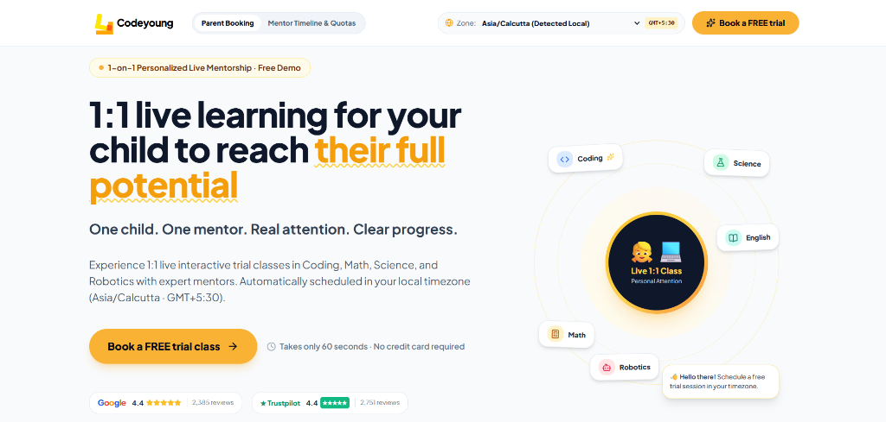
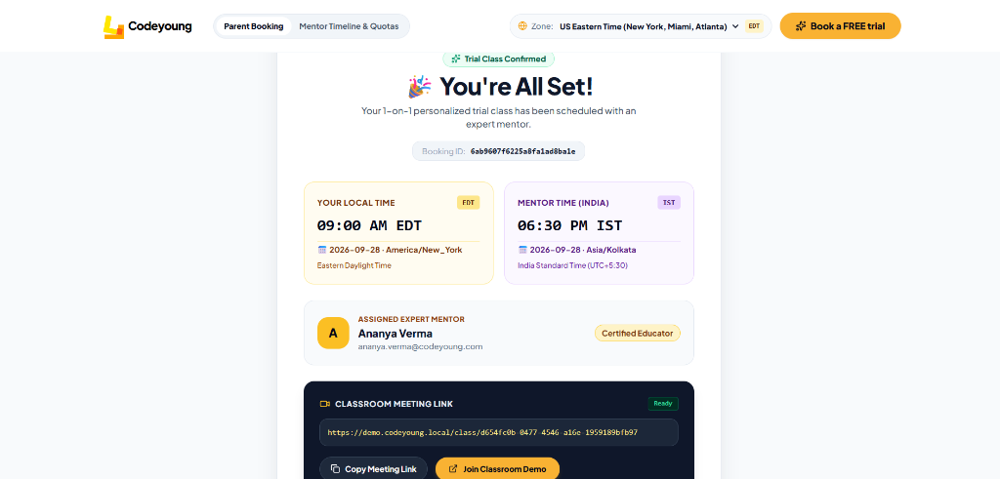
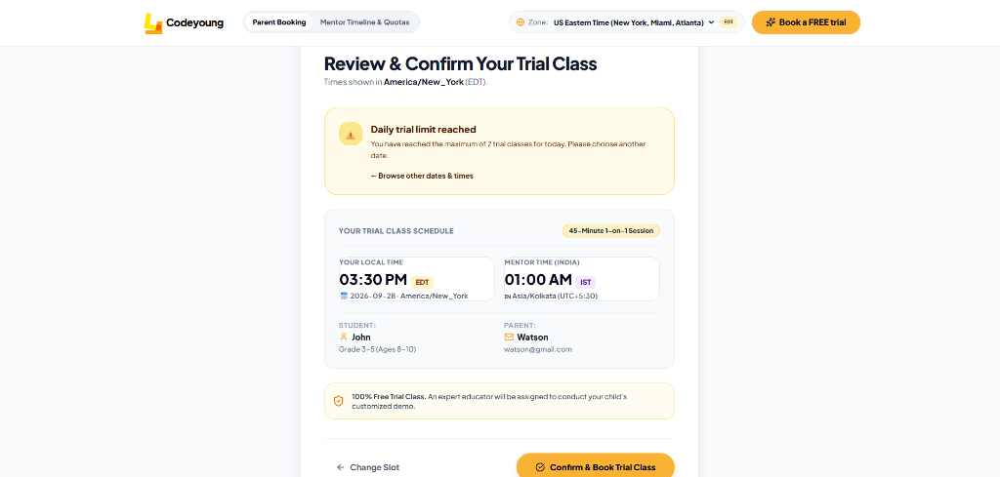

# Codeyoung Trial-Class Appointment Booking System

A production-grade full-stack trial-class appointment booking platform engineered to seamlessly coordinate parents across US and UK time zones with certified mentor educators in India (`Asia/Kolkata`), featuring dynamic IANA Daylight Saving Time (DST) handling, automated mentor load balancing, mentor and parent daily quota enforcement (max 2 classes/day), and transactional double-booking protection.
 
---

## 📸 Application Screenshots

### 1. Codeyoung Branded 1-on-1 Trial Class Landing Page
*Features 1-on-1 live learning value proposition, Trustpilot/Google review badges, live browser timezone auto-detection (`Intl.DateTimeFormat`), and subject exploration wheel.*



---

### 2. Dual Timezone Coordinated Confirmation & Classroom Access
*Unambiguous side-by-side presentation showing Parent Local Time (`09:00 AM EDT`) and Mentor Time (`06:30 PM IST`), certified instructor assignment, and instant classroom demo link.*



---

### 3. Parent Daily 2-Class Quota Guardrail & Friendly Suggestion UI
*Graceful error handling enforcing the 2-class-per-day parent limit with contextual recovery actions to select alternative dates without losing user inputs.*



---

## 🏗️ Architecture & Tech Stack

- **Frontend:** React 18, Vite, Tailwind CSS, Lucide React, Axios, Luxon (Dynamic IANA Timezone Engine)
- **Backend:** Node.js (ESM), Express.js (Layered Architecture: routes, controllers, services, repositories, models, middleware, utils)
- **Database:** MongoDB & Mongoose with compound unique partial indexes for zero race conditions
- **Timezone Engine:** Luxon with canonical IANA timezone identifiers (`America/New_York`, `Europe/London`, `Asia/Kolkata`)
- **Testing & E2E:** Node.js Native Test Runner (`node --test`), Playwright Chromium for Live Browser Testing

---

## 📁 Repository Structure

```
codeyoung-trial-booking/
├── docs/
│   └── screenshots/         # Application visual references
├── backend/
│   ├── src/
│   │   ├── config/          # Environment & MongoDB connection
│   │   ├── controllers/     # HTTP transport controllers
│   │   ├── middleware/      # Error handlers, rate limiters, validators
│   │   ├── models/          # Mongoose schemas (Mentor, Parent, Booking)
│   │   ├── repositories/    # Data access layer
│   │   ├── routes/          # Express route definitions
│   │   ├── seeds/           # Database seed script for 10 demo mentors
│   │   ├── services/        # Domain business logic (Booking, Availability, Timezone, Slot, Meeting)
│   │   ├── utils/           # Timezone, link helpers, and response envelopes
│   │   ├── app.js           # Express app factory
│   │   └── server.js        # Server listener
│   ├── tests/               # 63 unit, integration, and E2E acceptance test suites
│   ├── .env.example         # Backend environment template
│   ├── package.json
│   └── .gitignore
│
└── frontend/
    ├── src/
    │   ├── assets/          # SVG vectors, logos & branding assets
    │   ├── components/      # UI components (ParentDetails, DateTimeStep, ReviewStep, SuccessStep, MentorView)
    │   ├── services/        # Axios API client with unified error interceptors
    │   ├── utils/           # Client-side Luxon timezone formatters & auto-detection
    │   ├── App.jsx          # React app shell & 3-step customer-POV booking stepper
    │   ├── main.jsx         # React DOM root
    │   └── index.css        # Tailwind CSS directives & custom design tokens
    ├── .env.example         # Frontend environment template
    ├── tailwind.config.js   # Codeyoung brand theme configuration (#F9B233, navy typography)
    ├── vite.config.js       # Vite bundler configuration
    ├── package.json
    └── .gitignore
```

---

## 🚀 Getting Started

### Prerequisites
- Node.js (v18+ recommended)
- MongoDB running locally on `mongodb://127.0.0.1:27017/codeyoung_booking` (or remote MongoDB Atlas URI)

---

### Backend Setup

1. Navigate to the backend directory:
   ```bash
   cd backend
   ```

2. Install dependencies:
   ```bash
   npm install
   ```

3. Configure environment variables:
   ```bash
   cp .env.example .env
   ```

4. Seed the 10 certified demo mentors:
   ```bash
   npm run seed
   ```

5. Start the backend development server:
   ```bash
   npm run dev
   # or
   npm start
   ```
   *The API will be available at:* `http://localhost:5000`  
   *Health check:* `http://localhost:5000/api/health`

---

### Frontend Setup

1. Navigate to the frontend directory:
   ```bash
   cd frontend
   ```

2. Install dependencies:
   ```bash
   npm install
   ```

3. Configure environment variables:
   ```bash
   cp .env.example .env
   ```

4. Start the Vite development server:
   ```bash
   npm run dev
   ```
   *The application will be available at:* `http://localhost:5173`

---

## 🛡️ Business Rules & Safeguards

### 1. Mentor Daily Quota (Max 2 Classes/Day in IST)
- Each mentor can conduct at most **2 trial classes per local calendar day**.
- Quota is evaluated strictly against the mentor's local date in **`Asia/Kolkata`**.
- Handles midnight drift where a US evening appointment falls on the next morning in India.

### 2. Parent Daily Quota (Max 2 Classes/Day in Parent Local Time)
- A parent/guardian is allowed to book a **maximum of 2 trial classes per day**.
- Parent identity is stabilized using normalized email (`trim` + `lowercase`) and parent name.
- Quota is evaluated on the parent's local calendar day across timezone boundaries.

### 3. Duplicate Booking Protection
- Prevents duplicate bookings for the exact same parent and appointment time.
- Returns a friendly explanation: *"You already have a trial class booked for this time. Please choose another time."*

### 4. Dynamic Timezone & DST Engine (Zero Hardcoded Math)
- Uses canonical IANA timezone identifiers (`America/New_York`, `Europe/London`, `Asia/Kolkata`).
- Persists immutable UTC ISO-8601 instants in MongoDB (`startTimeUTC`).
- Dynamically resolves DST shifts (e.g. `EDT` UTC-4 vs `EST` UTC-5 around Nov 1, 2026).

---

## 🧪 Automated Testing Suite (63 Tests Passing)

The project includes a comprehensive test suite of **63 tests across 22 suites** covering functional rules, timezone math, and concurrency:

```text
✔ TimezoneService (44.5ms)
✔ MentorAvailabilityService (32.3ms)
✔ MeetingService (4.4ms)
✔ BookingService (265.0ms)
✔ Concurrency & Race Condition Mitigation (399.2ms)
✔ Parent Booking Rules & Daily Quota Guardrails (12 Test Cases) (1781.0ms)
✔ Codeyoung Trial Booking System - Comprehensive Suite (17 Requirements) (1027.6ms)

ℹ Test Suites: 22 passed, 22 total
ℹ Tests:       63 passed, 63 total
ℹ Snapshots:   0 total
ℹ Time:        9.84s
```

### Running the Tests

```bash
cd backend
npm test
```

---

## 🔒 Concurrency & Race Condition Strategy

When multiple parents submit requests for the same time slot at the exact same millisecond, the platform prevents double-booking through a two-tier strategy:

1. **Database-Level Compound Unique Partial Indexes:**
   ```javascript
   // Mentor Double-Booking Prevention
   BookingSchema.index(
     { mentorId: 1, startTimeUTC: 1 },
     { unique: true, partialFilterExpression: { status: 'CONFIRMED' } }
   );

   // Parent Duplicate Same-Time Prevention
   BookingSchema.index(
     { parentId: 1, startTimeUTC: 1 },
     { unique: true, partialFilterExpression: { status: 'CONFIRMED' } }
   );
   ```

2. **Candidate Fallback Allocation Loop:**
   If a mentor candidate encounters an atomic write collision (`E11000 duplicate key`), the service catches the collision and allocates the next available candidate mentor in the pool rather than failing the parent's booking.

---

## 📌 Known Limitations & Trade-Offs

- **No Multi-Document Distributed Transactions:** The standalone compound index + candidate loop was selected to ensure zero external replica-set requirements during local evaluation while guaranteeing single-mentor uniqueness.
- **In-Memory Candidate Evaluation:** Quotas and availability are evaluated against MongoDB indexed queries. For extreme scale (10,000+ requests/sec), Redis distributed locks or a Kafka reservation queue would be the next step.
- **Dummy Video Provider:** Meeting links use `https://demo.codeyoung.local/class/<uuid>` without integrating external video SDKs, matching assignment specifications.
